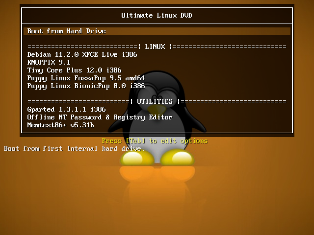

# Ultimate Linux DVD
Ultimate Linux DVD is a collection of Linux distributions created specifically for 4.7GB+ DVD. 

## Contains
[Debian GNU/Linux](https://www.debian.org/) Live [XFCE](https://xfce.org/) 
[KNOPPIX](https://knopper.net/knoppix/index-en.html) 
[Gparted live](https://gparted.org/livecd.php) 
[Offline NT password & registry editor](https://www.pogostick.net/~pnh/ntpasswd/) 
and more! 

The full lineup is described in the release notes.

## Download
**Nextcloud** -  
**Google Drive** - https://drive.google.com/file/d/1s277vUEnx2LJtuGvW-DqcrJAJRErJ1EP/view?usp=sharing

The collection is made in [XBoot](https://duckduckgo.com/?q=xboot). [Syslinux](https://syslinux.org/) is used.

